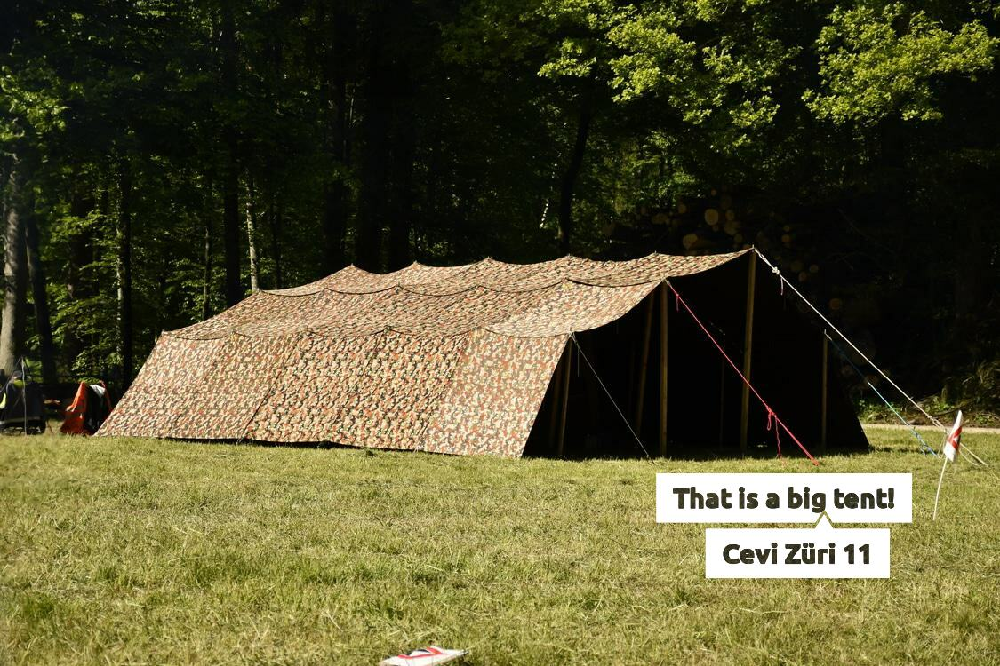

# Creates Responsive, Optimized and Annotated Images for Jekyll!



## Image Optimizing Pipeline

An automatic pipeline for image optimizing. This allows for the content creator to use images out of a camara, those
images are huge in filesize, e.g. around 2MB. The pipeline now automatically creates five images in different size and
optimizes them for file site. From our original image we get for example a 450x300px image with a file size of 40kB.

The image optimizing pipeline is implemented in `pre-processor.rb` and `image-optimizer.rb`.

The first script converts the markdown image tag into a custom format, which is the used by the second script to
generate HTML code.

The pre-processor takes in markdown code and converts an image:

```markdown

```

to the custom liquid tag:

```markdown
{
```

Which then gets processed by the image optimizer into, the image-optimizer automatically creates all needed image files
and stores them in the `imgs` folder.

```html

<figure class="image_figure">
    
    <span class="image_description"> Image description used as subtitle and alt text. </span>
</figure>
```

## Image Annotation

The pipeline allows a logo to be added to each image. The logo can be any vector graphic and can also be created on the
fly, containing for example the image caption. This is also how the picture above was created, from the following
Markdown line:

```markdown

```

An example of such a generation of the annotation image on the fly can be found in
the [cevi-logo-generator](https://github.com/wp99cp/responsive_images_for_jekyll/tree/cevi-logo-generator) branch.

## Installation / Use it for your own page

You can use this script in your project by adding it to your gem file:

```ruby
group :jekyll_plugins do
  gem "responsive-images-for-jekyll", git: 'https://github.com/wp99cp/responsive_images_for_jekyll'
end
```

Then you have to define the optimisation by adding the following lines to your `config.yml` file.

```yml
imageoptim:
  svgo: false   # Disabling svgo because it throws some error
  jpegrecompress:
    allow_lossy: true
    quality: 3
  jpegoptim:
    allow_lossy: true
    max_quality: 75
```

A full documentation for the optimization parameters can be found
here: 
- [jekyll-compress-images](https://github.com/valerijaspasojevic/jekyll-compress-images)
- and [image_optim](https://github.com/toy/image_optim)

## Thanks!

This script is based on the following repos:

- [MichaelCurrin/jekyll-resize](https://github.com/MichaelCurrin/jekyll-resize)
- [valerijaspasojevic/jekyll-compress-images](https://github.com/valerijaspasojevic/jekyll-compress-images)
- [toy/image_optim](https://github.com/toy/image_optim)
- [DannyBen/victor](https://github.com/DannyBen/victor)
